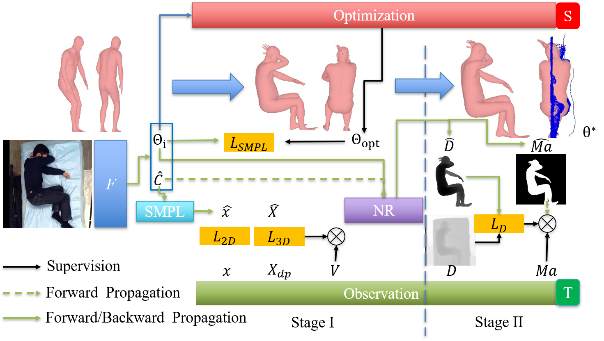
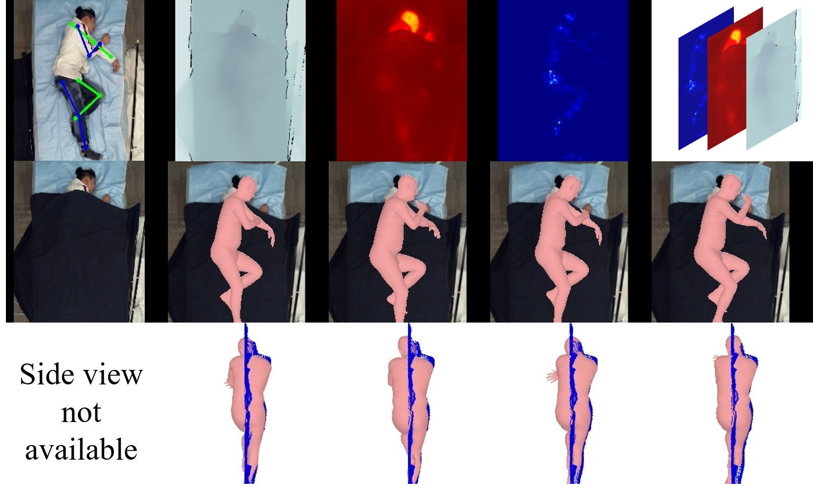

# Heuristic Weakly Supervised 3D Human Pose Estimation

This is the official repository for:

Liu, S., Wan, M., & Ostadabbas, S. "Heuristic Weakly Supervised 3D Human Pose Estimation." [[arXiv link]](https://arxiv.org/abs/2105.10996)

## Environment Setup
Install packages listed in `requirements.txt`. 
 
##  Data Preparation
Apply and download [SLP dataset](https://web.northeastern.edu/ostadabbas/2019/06/27/multimodal-in-bed-pose-estimation/).
  
Apply and download the [Human3.6M dataset](http://vision.imar.ro/human3.6m/description.php). Needed only if you wanna generate Human3.6M result. 

Apply and download the [3DPW dataset](https://virtualhumans.mpi-inf.mpg.de/3DPW/).  Needed only if you wanna generate 3DPW result. 

Apply and download the [MPII dataset](http://human-pose.mpi-inf.mpg.de/). Needed to fine tune Human3.6M as 2D part. 

Download the *SMPL* model [neutral model](http://smplify.is.tue.mpg.de) and extract to  `data/smpl`. You have to rename these models to `SMPL_[NEUTRAL|MALE|FEMALE].pkl` respectively. 
In case you need to convert the models to be compatible with python3, please follow the instructions [here](https://github.com/vchoutas/smplx/tree/master/tools).

Get the human36m regressor and pretrained model, etc by running `. fetch_data.sh`. We have kept the original SPIN extracted data on other datasets in case you want to include other data during your study. 

Donwload the smoothed version of SLP depth data [[link]](http://www.coe.neu.edu/Research/AClab/HW-HuP/SLP_AUG.zip) and add the extracted content to SLP folder.

Extract the Human3.6M image and depth file by `dataset/preprocess/h36m_2d_d.py`

## Model Deployment
We provide the pretrained models reported in our paper incuding 
SLP on 
[RGB](http://www.coe.neu.edu/Research/AClab/HW-HuP/model/SLP_3D_vis_d_e30.zip), 
[IR](http://www.coe.neu.edu/Research/AClab/HW-HuP/model/SLP_3D_vis_d_IR_e30.zip),
[PM](http://www.coe.neu.edu/Research/AClab/HW-HuP/model/SLP_3D_vis_d_PM_e30.zip),
[depth](http://www.coe.neu.edu/Research/AClab/HW-HuP/model/SLP_3D_vis_d_depth_e30.zip),
[combined](http://www.coe.neu.edu/Research/AClab/HW-HuP/model/SLP_3D_vis_d_stk_e30.zip). 

HW-HuP on Human3.6M [[link]](http://www.coe.neu.edu/Research/AClab/HW-HuP/model/h36m_2d_ft_e4.zip)

Extract all the pretrained models under `logs` 

## Experiment on SLP
The script is compatible to Slurm managed cluster
You can also run it via `sh` command accordingly.
**ATTENTION** All scripts will trigger the specific virtual env in our setting. Please modify to your specific virtual env if needed.  
  
**Training**:
 
RGB uncovered this setting is similar to common case used of original SPIN work (well illumiated RGB without heavy occlusion)
: `scripts/SLP_3D_vis_d.sbatch`

Extend to a more difficult case that the subjects may be under darkness and heavy occlusion where we employ the non-RGB modalities and their possible combinations including [IR|depth|PM]: 
`source scripts/allC/SLP_3D_vis_d.sbatch <exp_mod_name> <mod_name1> [mod_name2] ...` 
First `exp_mod_name` for exp name generation,  usually just same as `mod_name`.  
then following the mod name list, can be one modality or multiple.    

**Evaluation** 
for normal case RGB:
`source scripts/SLP_eval.sbatch <exp_name>`

for cover and darkness conditions (non-RGB):
`source scripts/SLP_eval_allC.sbatch <exp_name> <mod_name1> [mod_name2]` 

## Experiment on Human3.6M 
 **Training**
 `scripts/h36m_2d_ft` 
 
 **Evaluation** 
 `h36m_eval.sbatch [exp_name]` 
You can employ exp_name: h36m_2d_ft_e4 
  
## Evaluation on 3DPW 
`scripts/3dpw_eval [exp_name]` 
You can employ exp_name: h36m_2d_ft_e4 

## Utilities
If you wanna your customized dataset, we also provide the depth smoothing script in `datasets/preprocess/get_depth_dn` for `SLP` dataset. You can customize it accordingly for your own dataset to apply HW-HuP. 
 
## Demo Result on Real application without 3D annotation
### Real applicatioin on SLP dataset towards bed bound patient monitoring 

### Infant pose via a phone camera 
 
 

## Acknowledgement 
This code refers to the following repositories. Please also respect their LICENSE for specific usage.    

[SPIN]https://github.com/nkolot/SPIN

[Kinect_Smoothing]https://github.com/intelligent-control-lab/Kinect_Smoothing

## Citation 
If you find this work helpful, please cite the following works. 

    @article{liu2023heuristic,
      title={Heuristic Weakly Supervised 3D Human Pose Estimation},
      author={Liu, Shuangjun and Wan, Michael and Ostadabbas, Sarah},
      journal={arXiv preprint arXiv:2105.10996},
      year={2023}
    }
